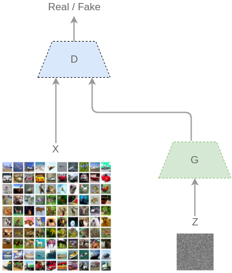
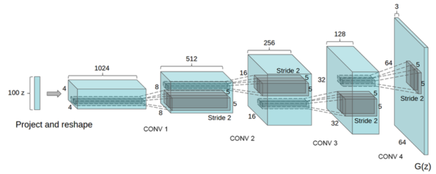

# GAN

## Table of Contents
- [Generative Adversarial Networks](#generative-adversarial-networks)
  - [2017.4.6](#2017-4-6)
  - [2017.8.1](#2017-8-1)
  - [2017.4.7](#2017-4-7)
  - [2017.4.5](#2017-4-5)

## Generative Adversarial Networks

### 2017 4 6
**Machine Learning**
机器学习的模型可大体分为两类，生成模型（Generative Model）和判别模型（Discriminative Model）。
1. 判别模型需要输入变量x ，通过某种模型来预测p(y|x) 。
2. 生成模型是给定某种隐含信息，来随机产生观测数据。

什么是机器学习？
一句话来概括就是，在训练过程中给予回馈，使得结果接近我们的期望。
1. 对于分类问题（classification），我们希望loss在接近bound以后，就不要再有变化，所以我们选择交叉熵（Cross Entropy）作为回馈；
2. 在回归问题（regression）中，我们则希望loss只有在两者一摸一样时才保持不变，所以选择点之间的欧式距离（MSE）作为回馈。

**损失函数**（回馈）的选择，会明显影响到训练结果的质量，是设计模型的重中之重。这五年来，神经网络的变种已有不下几百种，但损失函数却寥寥无几。
例如caffe的官方文档中，只提供了八种标准损失函数 Caffe | Layer Catalogue [CaffeLayerCatalogue](http://caffe.berkeleyvision.org/tutorial/layers.html)。

- 对于**判别模型**，损失函数是容易定义的，因为输出的目标相对简单。
- 但对于**生成模型**，损失函数的定义就不是那么容易。
例如:
  - 对于NLP方面的生成语句，虽然有BLEU这一优秀的衡量指标，但由于难以求导，以至于无法放进模型训练；
  - 对于生成猫咪图片的任务，如果简单地将损失函数定义为“和已有图片的欧式距离”，那么结果将是数据库里图片的诡异混合，效果惨不忍睹。

> 当我们希望神经网络画一只猫的时候，显然是希望这张图有一个动物的轮廓、带质感的毛发、和一个霸气的眼神，而不是冷冰冰的欧式距离最优解。如何将我们对于猫的期望放到模型中训练呢？这就是GAN的Adversarial部分解决的问题。

**Adversarial：对抗（互怼 ）**

在generative部分提到了，我们对于猫（生成结果）的期望，往往是一个暧昧不清，难以数学公理化定义的范式。但等一下，说到处理暧昧不清、难以公理化的问题，之前提到的判别任务不也是吗？比如图像分类，一堆RGB像素点和最后N类别的概率分布模型，显然是无法从传统数学角度定义的。那为何，不把**生成模型的回馈部分**，交给判别模型呢？这就是Goodfellow天才般的创意--他将机器学习中的两大类模型，**Generative和Discrimitive**给紧密地联合在了一起。

模型一览:

对抗生成网络主要由生成部分G，和判别部分D组成。
训练过程描述如下：

1. 输入噪声（隐藏变量）z
2. 通过生成部分G 得到x_{fake}=G(z)
3. 从真实数据集中取一部分真实数据x_{real}
4. 将两者混合x=x_{fake} + x_{real}
5. 将数据喂入判别部分D ，给定标签x_{fake}=0,x_{real}=1 （简单的二类分类器）
6. 按照分类结果，回传loss

在整个过程中，D要尽可能的使D(G(z))=0，D(x_{real})=1（火眼晶晶，不错杀也不漏杀）。而G则要使得D(G(z))=1，**即让生成的图片尽可能以假乱真**。整个训练过程就像是两个玩家在相互对抗，也正是这个名字Adversarial的来源。在论文中[1406.2661] [Generative Adversarial Networks](https://arxiv.org/abs/1406.2661)，Goodfellow从理论上证明了该算法的收敛性，以及在模型收敛时，生成数据具有和真实数据相同的分布（保证了模型效果）。

从研究角度，GAN给众多生成模型提供了一种新的训练思路，催生了许多后续作品。

例如根据自己喜好定制二次元妹子（逃），根据文字生成对应描述图片（[Newmu/dcgan_code](https://github.com/Newmu/dcgan_code), [hanzhanggit/StackGAN](https://github.com/hanzhanggit/StackGAN))，

甚至利用标签生成3D宜家家居模型（[zck119/3dgan-release](https://github.com/zck119/3dgan-release)），

这些作品的效果无一不令人惊叹。同时，难人可贵的是这篇论文有很强的数学论证，不同于前几年的套模型的结果说话，而是从理论上保证了模型的可靠性。虽然目前训练还时常碰到困难，后续已有更新工作改善该问题（WGAN, Loss Sensetive GAN, Least Square GAN)，相信终有一日能克服。

### 2017 8 1
**GAN对人工智能研究的意义和未来的发展方向**

GAN对于生成式模型的发展具有重要的意义，其作为一种生成式方法能够有效解决建立自然性解释数据的生成难题，尤其是对于生成高维数据，GAN所采用的神经网络结构不限制生成维度，极大的扩展了生成数据样本的范围。

GAN所采用的神经网络结构能够整合各类损失函数，增加了AI设计的自由度。GAN的训练过程创新性地将两个神经网络的对抗作为训练准则，并允许使用反向传播机制来进行训练，在训练过程中没有复杂的变分下界也不需要使用马尔可夫链方法（效率较低）以及做各种近似推理，大大改善了生成式模型的训练难度和训练效率。

GAN的生成过程不需要繁琐的采样序列，可以直接进行新样本的采样和推断，提高了新样本的生成效率。对抗训练方法摒弃了直接对真实数据的复制或平均，增加了生成样本的多样性。GAN在实践中生成的样本更易于人类理解，比如GAN能够生成十分清晰的图像。

GAN除了对生成式模型的贡献外，对于半监督学习的研究和发展也有启发。因为在GAN学习的过程中不需要制定数据标，尽管其提出的目的不是半监督学习，但是GAN的训练过程可以用来实施半监督学习中无标签数据对模型的预训练过程。具体来说就是先利用无标签数据训练GAN，再基于训练好的GAN对数据的理解，利用小部分有标签数据训练判别器，可以很好的进行传统分类与回归任务。

缺点：
* GAN采用的是对抗学习准则，我们目前从理论上还不能判断模型的收敛性和均衡点的存在性。
* GAN在训练过程中需要保证两个对抗网络的平衡与同步，否则难以得到很好的训练效果。而实际训练过程中，两个对抗网络的同步把控并不容易，导致了训练过程变得不稳定。

**发展、应用**
如何根据简单随机的输入生成多样的、能够与人类交互的数据，是近期GAN的一个应用的方向；
从GAN与其他机器学习方法交叉训练的角度来说，如何将GAN与特征学习、模仿学习和强化学习等技术更好地融合，开发出新的AI应用或促进这些学习方法的发展，是一个很有意义的发展方向；
从长远的角度来说，如何利用GAN推动人工智能的发展与应用、提升人工智能理解世界的能力、或者是激发人工智能的创造力是非常值得业界思考的方向。

作为一个具有“无限”生成能力的模型，GAN的最直接应用就是建模（生成与数据分布一致的数据样本），比如：生成图像和视频。
还有就是利用GAN进行模拟人工系统的生成和计算实验的分析，对平行控制中的人工系统和实际系统平行执行的过程通过建模的方式进行分析和评估，最后以平行方式来执行对复杂系统的控制的实现。在这一方面可以进行人工系统的预测学习和实际系统的反馈学习，在另一方面，也可以进行控制单元的模拟学习和强化学习。
其次，GAN还可以用以解决标注数据不足时的学习问题，常见的就是无监督学习。
再者，GAN在NLP领域也具有大显身手的能力，比如生成对话、由文本生成图像等。这种从潜在分布生成“无限”新样本的能力，在AI对图像和视觉计算、语音和语言处理、互联网与大型系统信息安全等领域具有重大的应用价值，这也是目前发展GAN对研究人工智能的主要意义。

### 2017 4
#### GAN方向
#### 理论方向
1.GAN[Generative Adversarial Nets](https://arxiv.org/pdf/1406.2661v1.pdf)原文是要求generator学习一个分布（精确讲这里其实并不是“学习”分布，而是我们已经提供一个高斯分布z，学习一个映射把高斯分布映射到更高维的空间）去拟合真实图像的分布。这篇文章最大的contribution前面也有人提了并不是生成看起来更自然真实的图像，而是用NN生成一个分布，这是它重大研究意义的核心所在。
2.CGAN[Conditional  Generative Adversarial Nets](https://arxiv.org/abs/1411.1784)在原本过于自由的训练基础上加了约束，指导数据生成过程。
3.DCGAN[Unsupervised Representation Learning with Deep Convolutional Generative Adversarial Networks](https://arxiv.org/abs/1511.06434)非常非常经典的一篇文章，GAN在CV领域的延伸，去除pooling和全连接层，使用反卷积。

4.关于GAN训练找纳什均衡点的问题一直存在，然后最近也出了很多文章从理论上改进GAN收敛性问题。包括WGAN[Wasserstein GAN](https://arxiv.org/abs/1701.07875)还有齐国君 老师的LS-GAN[Loss-Sensitive Generative Adversarial Networks on Lipschitz Densities](https://arxiv.org/abs/1701.06264)

#### 应用方向
这个数不胜数了。列一下transfer learning领域的吧：
1. DANN[Domain-Adversarial Training of Neural Networks](http://jmlr.org/papers/volume17/15-239/15-239.pdf)主要思路是target和source domain对抗形成一个相似的分布，这篇文章借用了GAN的思想，但只是采用负loss的形式，并没有GAN训练的时候找纳什均衡点的过程。
2. CoGAN[Coupled Generative Adversarial Networks](https://arxiv.org/abs/1606.07536)又是一篇经典之作，加了高层权值共享约束，学习一组联合分布，主要用来生成跨域的图片。

### 2017 4 7
> 作者：胡可可 链接：https://www.zhihu.com/question/57668112/answer/155775132

GAN毫无疑问成为最近几年的热点，ICLR会议上GAN占据了半壁江山。

不像贝叶斯生成模型，卷积是一种信息损失的操作，所以用来做识别的卷积神经网络很难再从低维数据生成原始数据。所以GAN这种结构的出现，很大程度上解决了神经网络的生成问题，或者说是第一个用神经网络真正做生成的方法（auto-encoder原始目的只是为了降维，并不是为了生成）。

首先讲讲为什么要用GAN。不像贝叶斯学习，神经网络无法或者很难做数据生成，也就是给定一个类别，生成对应类别的数据。

所以GAN的出现，很大程度上解决了神经网络的生成问题。然后说说GAN的作用。如果GAN只是用来生成一些像真是数据一样的数据的话，那不会有像现在这么火。

更多的，或者对于机器学习研究员来说，看待的最关键一点应该是GAN可以用来**拟合数据分布** 。

#### 什么叫拟合数据分布
就是给你一个训练数据，你能通过GAN这个工具，产生和这个数据分布相似的一些数据。有了拟合数据分布的思想，并在这上面做文章，才是一个真正的机器学习研究人员的素质。比如WGAN，也就是考虑到了GAN是一种拟合数据分布的工具，那么它可能和一些拟合数据分布的函数比如KL散度等是等价的，那么作者朝这个方向进行探索，自然能得出相应的结论，并且提出改进办法，使其成为风靡一时的工作。

其实，可以做的工作还有很多，比如，既然你有一个产生类似数据的工具，那么其实你就有了一个做数据增强的工具，也就是对于你的神经网络来说，你有更多的训练数据了。很多人可能会觉得这个想法很简单，其实并不然。因为GAN本身用神经网络训练，如果你能把它融入你的一个任务当中，只用加一些损失函数，其实就能提高你任务上的性能，而且很多人还会觉得你性能好是因为加了神奇的损失函数，其实不过是用GAN做了一些隐式的数据增强吧了。但是你可以随便吹自己的模型是多么厉害，损失函数设计得多么有意义，多绕几下，别人也就忘了不就是GAN增强了数据嘛。因为GAN给各个任务开了一条提高性能的大门，那每把GAN用在一个任务上，就得引用GAN这篇论文，引用量上去了自然就火了。而且原始GAN是难训练或者效果差的，那么这些嗷嗷待哺的任务和相关研究人员自然也会更多关注GAN的发展，以期望在自己的任务上用到最新，最好的技术。所以，最近做提高和改进GAN的工作也取得了极大的关注度。那么再解释一下这个工作变火的本质：以前的神经网络存在生成困难的问题，GAN提供了解决办法，该方法简单、强大、适用性广。

#### 再说说GAN和VAE的区别。

**GAN的目的是为了生成，而VAE目的是为了压缩**，目的不同自然效果不同。

由于二范数的原因，VAE的生成是模糊的。而GAN的生成是犀利的。最近也有VAE和GAN结合的工作，可自行查阅。

我觉得GAN只是用来拟合数据分布，和人类的灵感创作之类的概念还是不一样的。比如人作画，不是一个像素一个像素地画图，而是借助一些外部工具，比如笔刷，颜料什么的去作画。所以人能很容易地学会画画，并且画出有意义的图片，而GAN到现在还是只能生成一些低分辨率的图片。所以，通用AI应该是一个能够学习如何使用工具的AI。比如，让它通过Photoshop，用Photoshop里面的笔刷工具去生成一幅图片。

也就是说，对于自然界的一些高维信息，我们可以用一些比较通用的（预训练的）神经网络先去提取低维特征，**然后再去拟合这个低维特征的分布（而不是直接去拟合原始数据的分布）**。深度学习发展了这么年，虽然没能出现通用人工智能，至少从原始数据中提取一些低维特征向量还是没问题的，也就是说我们至少做到了通用人工智能的初级感知（相当于动物的本能）。希望下一步，我们能在这些本能的基础上构建更加智慧的通用AI。

另外什么纳什均衡，KL，JS散度只是一些技术分析，在知乎这种大众平台说这些没什么意义，专业人员可自行查阅相关论文（后面有个人说：“个人感觉，gan之所以比其他生成模型更优秀，是因为gan在本质上相当于最优化js距离而不是kl距离。” 这说得好像js距离和GAN的loss的等价是他提出来的一样，明明就有相关论文很好的说明了这一点，难道还需要你来感觉一下？最讨厌这种不自己真正理解问题，拿别人观点或结论装逼的人）。很多理论论文的lowerbound，optmization等推导，对实际工作没有太多指导意义，或者对现实数据并不适用，而且不利于科普，我是不会讲的。

### 2017 4 5
随便翻翻最近很多DL的工作成果可以看得到大量的都是“生成”比如waifu2x。

基于深度学习的图像超分辨比如从去年开始突然开始很火的。

基于DL的图像风格转换GAN，本质上也是一种“生成”，不过主要思想在于有两条路线一条是“生成”，一条则是“判断”。

两条路线处于博弈的关系，也就是说，判断的路线希望再细微的细节也能找出来。而生成的路线，则希望能够把“赝品”做的越真越好。

深度学习，得天独厚的一大优势就是：一旦给定模型，剩下的就是不断迭代，然后参数会慢慢向一个“你更想要”的方向去收敛。

而一般情况下，这种收敛的计算只是一种纯粹的无干预的形式，你最多只能用定型的样本去进行约束。

**Gan的好处则是，“样本”是处于不断变化的过程的。这样，不仅仅生成路线，做出的东西越来越真。判断路线判断的水平也会越来越高。**

> 作者：文刀叉点 链接：https://www.zhihu.com/question/57668112/answer/155476359

