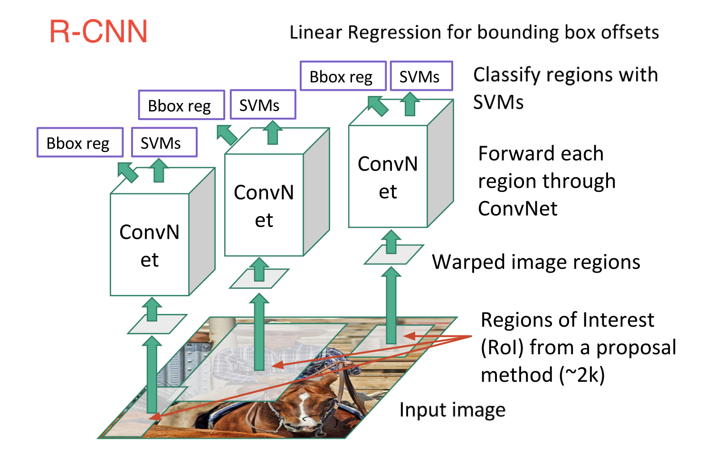
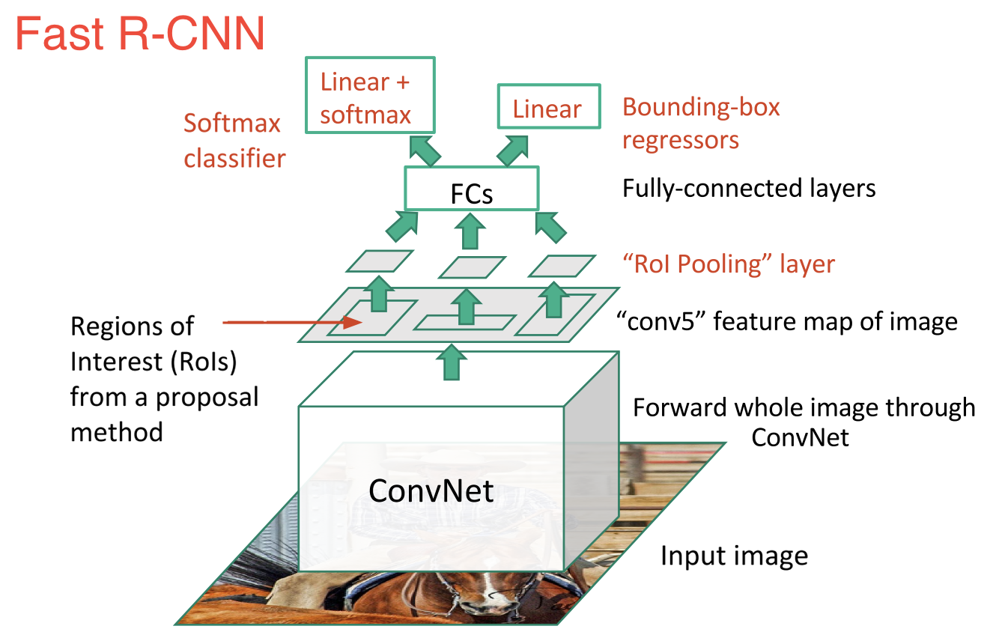
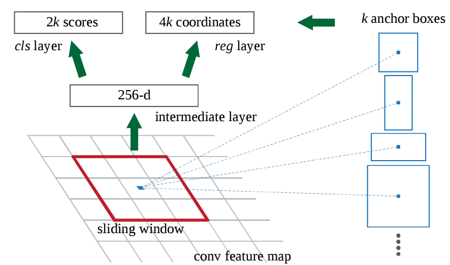
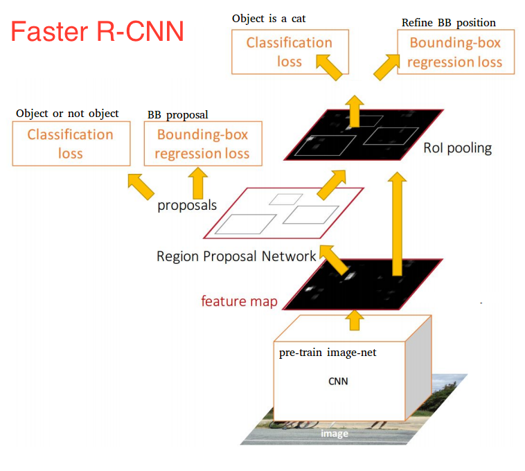
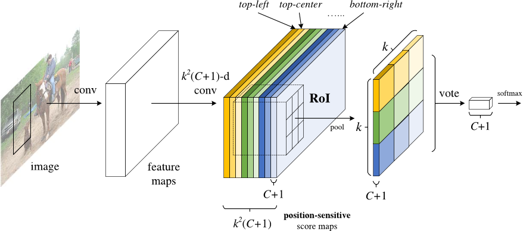
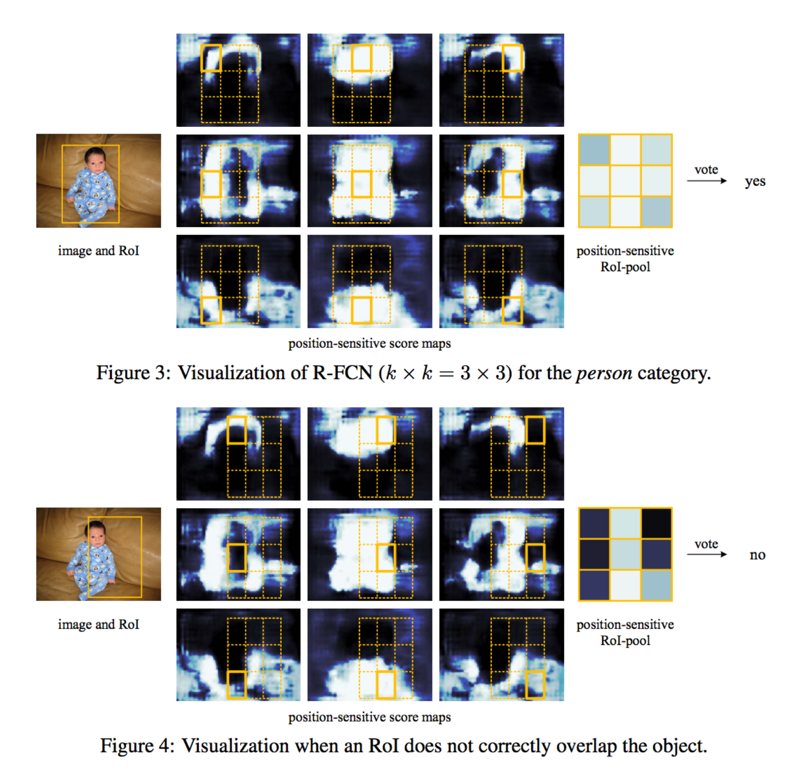
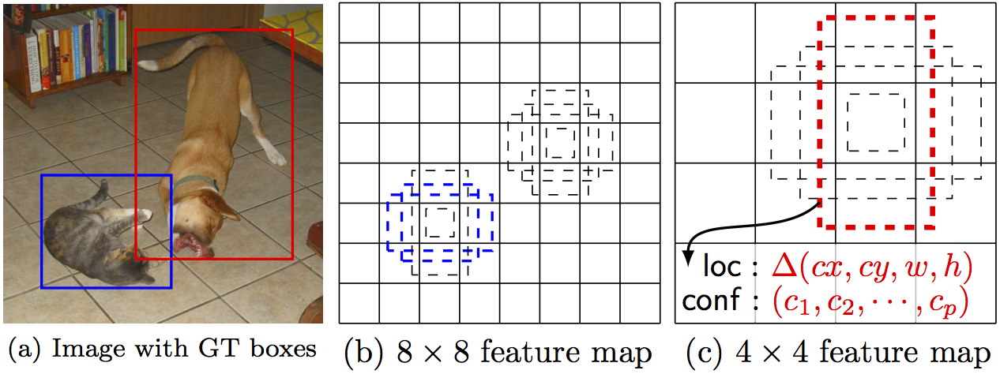

# Object Detection

- [Object Detection](#object-detection)
  - [2017.3](#2017-3)
  - [2017.4](#2017-4)
  - [2016.7](#2016-7)
  - [2016.9](#2016-9)
  - [Summary of FasterRnn RFCN SSD](#summary-of-fasterrnn-rfcn-ssd)
    - [FASTER RCNN](#faster-rcnn)

## Object Detection
物体检测

---------
### 2017 3
**目前物体检测模型大概的分类：**
1. region proposal，如RCNN、SPP-Net、Fast-RCNN、Faster-RCNN以及MSRA最近的工作R-FCN。
2. 不使用region proposal的，YOLO，SSD。

**Target And Trend (趋势及目标)**
* 让不同ROI之间尽量多的共享计算量，并充分利用CNN得到的特征，使得整个detection的速度变快。

**region proposal 流程**
1. 从待检测的图片中，提取出N个**ROI**，这里N远大于图片中真实object的个数。具体的方法有selective search、edge box以及最近流行起来的RPN。
2. 根据1中检测到的ROI，上CNN对图像进行feature extraction。
3. 对2中得到的feature进行分类，比如对于PSACAL VOC数据，就是一个21分类的问题（20个object class+background）。
4. boudningbox regression。

**tips:**
1. RCNN对于每个ROI，都跑一遍CNN，即使这些ROI之间是有overlap的，**显然有部分计算是重复的**，所以SPP-net和fast rcnn就在这方面做了文章，具体做法是先用CNN抽取整张图的特征，然后利用ROI pooling抽取对应ROI的特征，使得不同ROI共享特征提取的计算量。结果就是原来我处理一张图像需要前向2000次CNN，现在只要前向一次就好了，极大的提升了计算速度。
2. fast rcnn还通过multi-task loss实现了一个end to end 的系统，这里不是我们的重点。fast-rcnn提出来之后，detection的性能瓶颈变成了计算region proposal。CPU实现的selective search处理一张图需要2秒钟，远大于GPU上CNN特征抽取的时间。Faster RCNN就是要解决这个问题，他的出发点是这样的：既然用CNN进行feature extraction这一步已经无法避免，那么我们为什么不更充分地利用得到的feature？具体来说，我们是不是可以直接用CNN得到的feature来进行region proposal，答案是肯定的。
3. Faster RCNN将CNN得到的feature输入到一个两层网络（RPN），网络的输出就是region proposal。这样一来，**region proposal的额外开销就只有一个两层网络**。实验证明这样不仅速度变快，而且proposal的质量也更高了。
4. 到目前为止，上面我们说的4个步骤中，第1步和第2步都可以通过**前向一遍CNN**来得到，所以前俩步都不再是速度的瓶颈。
5. 然后我们考虑第3步，假设我们用faster rcnn的RPN得到了300个region proposal，在预测的过程中，我们需要对300个region proposal去做分类，每个region proposal都要经过多个FC层，这个时间开销仍然是很大的，所以就有了**R-FCN**这个工作。具体来说，是先利用FCN进行类似semantic segmentation的计算，然后利用ROI对相应的区域进行average pooling，得到整个ROI关于21个类别的置信度。简单的说就是把分类这个过程也融合到网络的前向计算过程中，由于这个过程对于不同的ROI是共享的，所以比单独跑分类器要快好多。文章里还有一个position-sensitive的idea，也很有趣，
6. 个人感觉object detection是一个比较考验insight以及”让一个idea真正能work的能力“的方向，不像semantic segmentation，后者现在的提升很多靠CRF，有陷入”图模型加圈“（传说中水论文三大法宝之一）的趋势，对数学要求比较高。

*作者：Old Xie  链接：https://www.zhihu.com/question/34223049/answer/110071873*

-------

### 2017 4
**目标检测框架大致的类别：**
#### 1. region proposal + refinement

检测分两步进行，以Faster R-CNN, R-FCN 等为代表；
Google 在16年下半年出了一篇paper，详细比较了Faster R-CNN、R-FCN和SSD的各个性能指标，还是很值得一读的。[Speed/accuracy trade-offs for modern convolutional object detectors](https://arxiv.org/abs/1611.10012)

上面的图即来自于Google的论文。一个比较粗略的结论是：
* 第一类框架（Faster R-CNN）的性能会更好，但是速度较慢；
* 而第二类框架（SSD）的性能略微逊色，但是速度较快。
当然这个结论并不是绝对成立的，具体得看不同的数据集类型、网络类型等等。

#### 2. 另一类是single stage的，一步到位回归出物体的位置，以SSD, YOLO 等为代表。

传统的目标检测总的发展方向有两条线：一条线是提高检测的精度、另一条线是提高检测的速度（效率）。
1. 对于提高检测的速度，从最初的R-CNN、Fast R-CNN、Faster R-CNN、SSD一路走来，私以为提高的空间已经不大了。SSD已经把能share的计算完全共享了，要再减小复杂度的话只能从精简网络结构/模型压缩等方面入手了（如PVANET:Lightweight Deep Neural Networks for Real-time Object Detection）。
2. 对于提高检测的精度，16年下半年来一个趋势是研究不同层之间的特征融合。一个很直观的想法是，神经网络的低层通常保留了比较多的细节特征（fine-grained）；而高层通常有更好的语义特征。所以怎么去结合不同层间的特征成了一个比较火的方向。

**papers:**
1.在不同层上面做proposal / pooling:
* [1607.07155] [A Unified Multi-scale Deep Convolutional Neural Network for Fast Object Detection](https://arxiv.org/abs/1607.07155)
* [SDP-CRC:CVPR 2016 Open Access Repository](https://www.cv-foundation.org/openaccess/content_cvpr_2016/html/Yang_Exploit_All_the_CVPR_2016_paper.html)
2.把不同层的特征级联在一起:
* [Towards Accurate Region Proposal Generation and Joint Object Detection](https://arxiv.org/abs/1604.00600)
3.bottom-up / top-down 的特征融合
* [1612.03144] [Feature Pyramid Networks for Object Detection](https://arxiv.org/abs/1612.03144)
* [Top-Down Modulation for Object Detection](https://arxiv.org/abs/1612.06851)
* [Deconvolutional Single Shot Detector](https://arxiv.org/abs/1701.06659)
4.多次迭代特征融合
* [1704.05776] [Accurate Single Stage Detector Using Recurrent Rolling Convolution](https://arxiv.org/abs/1704.05776)
等等类似的工作还有很多，在不同层上去取特征似乎已经成了目标检测一种套路了。

> 目标检测是一个很经典的问题。个人感觉现在要在这上面挖出一些gain来已经不是那么容易的了。或许可以关注一些相关的问题，比如视频中的目标检测、弱监督目标检测等等。
另外还有不少工作落脚于一些与目标检测紧密相关的任务上。比如Kaiming大神的[Mask R-CNN](https://arxiv.org/abs/1703.06870) 就是 object detection + segmentation + key point detection。这种多任务的学习可能也是一个值得关注的方向。

*链接：https://www.zhihu.com/question/34223049/answer/160336559*

------------------
### 2016 7
#### 传统方法的对比：

传统方法使用滑动窗口的框架，把一张图分解成几百万个不同位置，不同尺度的子窗口，针对每一个窗口使用分类器判断是否包含目标物体。

传统方法针对不同的类别的物体，一般会设计不同的特征和分类算法，比如
- 人脸检测的经典算法是**Harr特征+Adaboosting分类器**;
- 行人检测的经典算法是**HOG(histogram of gradients) + Support Vector Machine**;
- 一般性物体的检测的话是**HOG的特征 + DPM(deformable part model)**的算法。

基于深度学习的物体检测的经典算法是RCNN系列：**RCNN, fast RCNN(Ross Girshick), faster RCNN**。这三个工作的核心思想分别是：
* 使用更好的CNN模型判断候选区域的类别
* 复用预计算的sharing feature map加快模型训练和物体检测的速度
* 进一步使用sharing feature map大幅度提高计算候选区域的速度
其实基于深度学习的物体检测可以堪称对海量滑动窗口分类，只是使用的是全卷积的方式

RCNN系列算法还是将物体检测分为两个步骤。现在还有一些工作是端到端(end-to-end)的物体检测，比如说：
YOLO(You Only Look Once: Unified, Real-Time Object Detection)和SSD(SSD: Single Shot MultiBox Detector)这样的算法。
这两个算法号称和faster RNN精度相似但速度更快。物体检测正负样本极端非均衡，two-stage cascade可以更好的应对非均衡。端到端学习是否可以超越faster RCNN还需要更多研究试验。

------------

### 2016 9
1.ROI+DL主流，ROI主要是为了降低运算量，DL为了做检测分类，前面的答主都答得很详细了。
2.补充第二点，主要是无监督+目标检测，例如利用optical flow获取video的连续性,把连续性作为一个免费的supervision
* [Unsupervised Learning of Visual Representations using Videos](http://arxiv.org/abs/1505.00687),
* [UNSUPERVISED FEATURE LEARNING FROM TEMPORAL DATA](http://arxiv.org/pdf/1504.02518v2.pdf)，
结合之后就对检测能起到增强学习的一定作用。

### Summary of FasterRnn RFCN SSD

综述
> Faster R-CNN、R-FCN 和 SSD 是三种目前最优且应用最广泛的目标检测模型，其他流行的模型通常与这三者类似。
本文介绍了深度学习目标检测的三种常见模型：Faster R-CNN、R-FCN 和 SSD。

对图像中的每个目标进行识别、分类以外，还可以通过在该目标周围绘制适当大小的边界框（bounding box）来对其进行**定位**。这让目标检测技术较传统计算机视觉处理技术——图像分类而言，难度上升了不少。

目前最成功的目标检测方法是对图像分类模型的扩展。
Google 为 Tensorflow 发布了一个新的目标检测 API。与其同时发布的还有针对一些特定模型预构建的框架和权重。

* 基于 MobileNets 框架的 Single Shot Multibox Detector（SSD）模型。
* 基于 Inception V2 框架的 SSD 模型。
* 使用 ResNet-101 框架的基于 Region 的全卷积网络（R-FCN）模型。
* 基于 ResNet-101 框架的 Faster RCNN 模型。
* 基于 Inception ResNet v2 的 Faster RCNN 模型。

#### 本文内容
1. 深度学习是如何在目标检测中得到应用的。
2. 这些目标检测模型的设计是如何在相互之间获得灵感的同时也有各自的特点。

#### FASTER RCNN
> Faster R-CNN 模型现在是一个典型的基于深度学习的目标检测模型。在它的启发下，出现了很多目标检测与分割模型，比如本文中我们将会看到的另外两个模型。然而，要真正开始了解 Faster R-CNN 我们需要理解其之前的 R-CNN 和 Fast R-CNN。所以，现在我们快速介绍一下 Faster R-CNN 的来龙去脉。

##### R-CNN 模型

如果要拟人化比喻，那 R-CNN 肯定是 Faster R-CNN 的祖父了。换句话说，R-CNN 是一切的开端。

R-CNN，或称 Region-based Convolutional Neural Network，其工作包含了三个步骤：

* 借助一个可以生成约 2000 个 region proposal 的「选择性搜索」（Selective Search）算法，R-CNN 可以对输入图像进行扫描，来获取可能出现的目标。
* 在每个 region proposal 上都运行一个卷积神经网络（CNN）。
* 将每个 CNN 的输出都输入进：a）一个支持向量机（SVM），以对上述区域进行分类。b）一个线性回归器，以收缩目标周围的边界框，前提是这样的目标存在。

下图具体描绘了上述 3 个步骤：

换句话说，首先，我们给出一些建议区域，然后，从中提取出特征，之后，再根据这些特征来对这些区域进行分类。

本质而言，我们将**目标检测转化成了图像分类**问题。R-CNN 模型虽然非常直观，但是速度很慢。

##### Fast R-CNN

直接承接 R-CNN 的是 Fast R-CNN。

Fast R-CNN 在很多方面与 R-CNN 类似，但是，凭借两项主要的增强手段，其检测速度较 R-CNN 有所提高：

* 在推荐区域之前，先对图像执行特征提取工作，通过这种办法，后面只用对整个图像使用一个 CNN（之前的 R-CNN 网络需要在 2000 个重叠的区域上分别运行 2000 个 CNN）。
* 将支持向量机替换成了一个 softmax 层，这种变化并没有创建新的模型，而是将神经网络进行了扩展以用于预测工作。

Fast R-CNN 模型结构示意图：

如图所见，现在我们基于网络最后的特征图（而非原始图像）创建了 region proposals。因此，我们对整幅图只用训练一个 CNN 就可以了。

此外，我们使用了一个 softmax 层来直接输出类（class）的概率，而不是像之前一样训练**很多不同**的 SVM 去对每个目标类（object class）进行分类。**现在，我们只用训练一个神经网络，而之前我们需要训练一个神经网络以及很多 SVM。**

就速度而言，Fast R-CNN 提升了许多。

然而，存在一大未解决的瓶颈：用于生成 region proposal 的**选择搜索算法（selective search algorithm）**。

##### FASTER R-CNN

到现在为止，我们完成了对 Faster R-CNN 两大早期模型的溯源。下面我们开始研究 Faster R-CNN。

Faster R-CNN 的主要创新是，它用一个**快速神经网络**代替了之前**慢速的选择搜索算法（selective search algorithm）**。

**具体而言，它引入了一个 region proposal 网络（RPN）。**

RPN 工作原理：

* 在最后卷积得到的特征图上，使用一个 3x3 的窗口在特征图上滑动，然后将其映射到一个更低的维度上（如 256 维），
* 在每个滑动窗口的位置上，RPN 都可以基于 k 个固定比例的 anchor box（默认的边界框）生成多个可能的区域。
* 每个 region proposal 都由两部分组成：a）该区域的 objectness 分数。b）4 个表征该区域边界框的坐标。

换句话说，我们会观察我们最后特征图上的每个位置，然后关注围绕它的 k 个不同的 anchor box：一个高的框、一个宽的框、一个大的框等等。对于每个这些框，不管我们是否认为它包含一个目标，以及不管这个框里的坐标是什么，我们都会进行输出。

下图展示了在单个滑动框位置上发生的操作：

图中 2k 分数代表了 k 中每一个边界框正好覆盖「目标」的 softmax 概率。这里注意到，尽管 RPN 输出了边界框的坐标，然而它并不会去对任何可能的目标进行分类：它惟一的工作仍然是给出**对象区域**。如果一个 anchor box 在特定阈值之上存在一个「objectness」分数，那么这个边界框的坐标就会作为一个 region proposal 被向前传递。

一旦我们有了 region proposal，我们就直接把他们输入一个本质上是 Fast R-CNN 的模型。我们再添加一个池化层、一些全连接层以及最后，一个 softmax 分类层和边界框回归器（bounding box regressor）。所以在某种意义上，Faster R-CNN=RPN+Fast R-CNN。

总体而言，Faster R-CNN 较 Fast R-CNN 在速度上有了大幅提升，而且其精确性也达到了最尖端的水平。值得一提的是，尽管未来的模型能够在检测速度上有所提升，但是几乎没有模型的表现能显著超越 Faster R-CNN。换句话说，Faster R-CNN 也许不是目标检测最简单、最快的方法，但是其表现还是目前最佳的。例如，Tensorflow 应用 Inception ResNet 打造的 Faster R-CNN 就是他们速度最慢，但却最精准的模型。

也许 Faster R-CNN 看起来可能会非常复杂，但是它的核心设计还是与最初的 R-CNN 一致：

**先假设对象区域，然后对其进行分类。**目前，这是很多目标检测模型使用的主要思路，包括我们接下来将要提到的这个模型。

##### R-FCN

> 还记得 Fast R-CNN 是如何通过在所有 region proposal 上共享同一个 CNN，来改善检测速度的吗？这也是设计 R-FCN 的一个动机：通过最大化共享计算来提升速度。

R-FCN，或称 Region-based Fully Convolutional Net（基于区域的全卷积网络），可以在每个输出之间完全共享计算。作为全卷积网络，它在模型设计过程中遇到了一个特殊的问题。

一方面，当对一个目标进行分类任务时，我们希望学到模型中的位置不变性（location invariance）：无论这只猫出现在图中的哪个位置，我们都想将它分类成一只猫。另一方面，当进行目标检测任务时，我们希望学习到位置可变性（location variance）：如果这只猫在左上角，那么我们希望在图像左上角这个位置画一个框。所以，问题出现了，如果想在网络中 100% 共享卷积计算的话，我们应该如何在位置不变性（location invariance）和位置可变性（location variance）之间做出权衡呢？

R-FCN 的解决方案：位置敏感分数图

每个位置敏感分数图都代表了一个目标类（object class）的一个相关位置。例如，只要是在图像右上角检测到一只猫，就会激活一个分数图（score map）。而当系统看见左下角出现一辆车时，另一个分数图也将会被激活。本质上来讲，这些分数图都是卷积特征图，**它们被训练来识别每个目标的特定部位**。

以下是 R-FCN 的工作方式：

1. 在输入图像上运行一个 CNN（本例中使用的是 ResNet）。
2. 添加一个全卷积层，以生成位置敏感分数图的 score bank。这里应该有 k²(C+1) 个分数图，其中，k²代表切分一个目标的相关位置的数量（比如，3²代表一个 3x3 的空间网格），C+1 代表 C 个类外加一个背景。
3. 运行一个全卷积 region proposal 网络（RPN），以生成感兴趣区域（regions of interest，RoI）。
4. 对于每个 RoI，我们都将其切分成同样的 k²个子区域，然后将这些子区域作为分数图。
5. 对每个子区域，我们检查其 score bank，以判断这个子区域是否匹配具体目标的对应位置。比如，如果我们处在「上-左」子区域，那我们就会获取与这个目标「上-左」子区域对应的分数图，并且在感兴趣区域（RoI region）里对那些值取平均。对每个类我们都要进行这个过程。
6. 一旦每个 k²子区域都具备每个类的「目标匹配」值，那么我们就可以对这些子区域求平均值，得到每个类的分数。
7. 通过对剩下 C+1 个维度向量进行 softmax 回归，来对 RoI 进行分类。

下面是 R-FCN 的示意图，用 RPN 生成 RoI：

当然，即便有上述文字以及图片的解释，你可能仍然不太明白这个模型的工作方式。老实说，当你可以实际看到 R-FCN 的工作过程时，你会发现理解起来会更加简单。

下面就是一个在实践中应用的 R-FCN，它正在从图中检测一个婴儿：

我们只用简单地让 R-FCN 去处理每个 region proposal，然后将其切分成子区域，在子区域上反复询问系统：「这看起来像是婴儿的『上-左』部分吗？」，「这看起来像是婴儿的『上-中』部分吗？」，「这看起来像是婴儿的『上-右』部分吗？」等等。系统会对所有类重复这个过程。如果有足够的子区域表示「是的，我的确匹配婴儿的这个部分！」那么 RoI 就会通过对所有类进行 softmax 回归的方式被分类成一个婴儿。」

借助这种设置，R-FCN 便能同时处理位置可变性（location variance）与位置不变性（location invariance）。它给出不同的目标区域来处理位置可变性，让每个 region proposal 都参考同一个分数图 score bank 来处理位置不变形。这些分数图应该去学习将一只猫分类成猫，而不用管这只猫在在那个位置。最好的是，由于它是全卷积的，所以这意味着网络中所有的计算都是共享的。

因此，R-FCN 比 Faster R-CNN 快了好几倍，并且可以达到类似的准确率。

##### SSD
我们最后一个模型是 SSD，即 Single-Shot Detector。和 R-FCN 一样，它的速度比 Faster R-CNN 要快很多，但其工作方式却和 R-FCN 存在显著不同。

我们前两个模型分两个步骤执行 region proposal 和 region classification。首先，它们使用一个 region proposal 网络来生成感兴趣区域（region of interest）；然后，它们既可以用全连接层也可以用位置敏感卷积层来对那些区域进行分类。然而，SSD 可以在单个步骤中完成上述两个步骤，并且在处理图像的同时预测边界框和类。

具体而言，给定一个输入图像以及一系列真值标签，SSD 就会进行如下操作：

1. 在一系列卷积层中传递这个图像，产生一系列大小不同的特征图（比如 10x10、6x6、3x3 等等。）
2. 对每个这些特征图中的每个位置而言，都使用一个 3x3 的卷积滤波器（convolutional filter）来评估一小部分默认的边界框。这些默认边的界框本质上等价于 Faster R-CNN 的 anchor box。
3. 对每个边界框都同时执行预测： a）边界框的偏移；b）分类的概率。
4. 在训练期间，用这些基于 IoU（Intersection over Union，也被称为 Jaccard 相似系数）系数的预测边界框来匹配正确的边界框。被最佳预测的边界框将被标签为「正」，并且其它边界框的 IoU 大于 0.5。

SSD 的工作方式听上去很直接，但是训练它却会面临一个不一般的挑战。在之前那两个模型那里，region proposal 网络可以确保每个我们尝试进行分类的对象都会有一个作为「目标」的最小概率值。然而，在 SSD 这里，我们跳过了这个筛选步骤。我们从图像中每个单一位置那里进行分类并画出形状、大小不同的边界框。通过这种办法，我们可以生成比别的模型更多的边界框，但是它们基本上全是负面样本。

为了解决这个问题，SSD 进行了两项处理。首先，它使用非极大值抑制（non maximum suppression，NMS）技术来将高度重叠的边界框整合成一个。换句话说，如果有 4 个形状、尺寸等类似的边界框中有同一只狗，那么 NMS 就会保留信度最高的那个边界框而抛弃掉其它的。第二，SSD 模型使用了一种被称为 hard negative mining 的技术以在训练过程中让类保持平衡。在 hard negative mining 中，只有那些有最高训练损失（training loss）的负面样本（negative example）子集才会在每次训练迭代中被使用。SSD 的「正负」比一直保持在 1:3。

下图是 SSD 的架构示意图：

如上所述，最终有可缩小尺寸的「额外特征层」。这些尺寸变化的特征图有助于捕捉不同大小的目标。例如，下面是一个正在执行的 SSD。

在更小的特征图中（比如 4x4），每一单元覆盖图像的一个更大区域，使其探测更大的目标。region proposal 与分类同时被执行：假设 p 为目标类别，每个边界框与一个 (4+p)-维度向量相连接，其输出 4 个框偏移坐标和 p 分类概率。在最后一步中，softmax 又一次被用来分类目标。

最终，SSD 与最初的两个模型并无不同。它简单跳过「region proposal」这一步，而不是同时考虑图像每个位置的每个边界及其分类。由于 SSD 一次性完成所有，它是三个模型中最快的，且相对而言依然表现出色。

##### 结论

Faster R-CNN、R-FCN 和 SSD 是三种目前最优且应用最广泛的目标检测模型。其他流行的模型通常与这三者类似，都依赖于深度 CNN（如 ResNet、Inception 等）来进行网络初始化，且大部分遵循同样的 proposal／分类 pipeline。

但是，使用这些模型需要了解 Tensorflow 的 API。Tensorflow 有一份使用这些模型的初学者教程。

*原文链接[link](https://medium.com/towards-data-science/deep-learning-for-object-detection-a-comprehensive-review-73930816d8d9)*