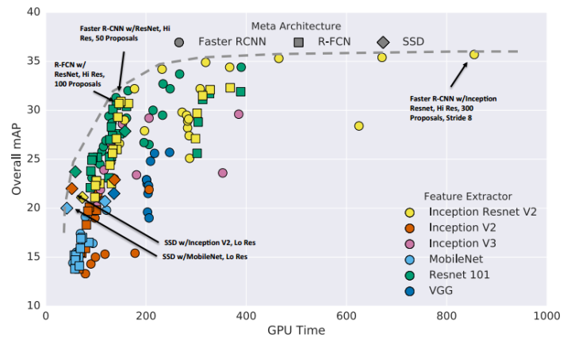

- [Object Detection](#object-detection)
  - [region proposal](#region-proposal)
  - [tips](#tips)

### Object Detection
物体检测
1. region proposal，如RCNN、SPP-Net、Fast-RCNN、Faster-RCNN以及MSRA最近的工作R-FCN。
2. 不使用region proposal的，YOLO，SSD。

Target And Trend 趋势及目标
* 让不同ROI之间尽量多的共享计算量，并充分利用CNN得到的特征，使得整个detection的速度变快。

#### region proposal
流程
1. 从待检测的图片中，提取出N个**ROI**，这里N远大于图片中真实object的个数。具体的方法有selective search、edge box以及最近流行起来的RPN。
2. 根据1中检测到的ROI，上CNN对图像进行feature extraction。
3. 对2中得到的feature进行分类，比如对于PSACAL VOC数据，就是一个21分类的问题（20个object class+background）。
4. boudningbox regression。

#### tips:
1. RCNN对于每个ROI，都跑一遍CNN，即使这些ROI之间是有overlap的，`显然有部分计算是重复的`，所以SPP-net和fast rcnn就在这方面做了文章，具体做法是先用CNN抽取整张图的特征，然后利用ROI pooling抽取对应ROI的特征，使得不同ROI共享特征提取的计算量。结果就是原来我处理一张图像需要前向2000次CNN，现在只要前向一次就好了，极大的提升了计算速度。
2. fast rcnn还通过multi-task loss实现了一个end to end 的系统，这里不是我们的重点。fast-rcnn提出来之后，detection的性能瓶颈变成了计算region proposal。CPU实现的selective search处理一张图需要2秒钟，远大于GPU上CNN特征抽取的时间。Faster RCNN就是要解决这个问题，他的出发点是这样的：既然用CNN进行feature extraction这一步已经无法避免，那么我们为什么不更充分地利用得到的feature？具体来说，我们是不是可以直接用CNN得到的feature来进行region proposal，答案是肯定的。
3. Faster RCNN将CNN得到的feature输入到一个两层网络（RPN），网络的输出就是region proposal。这样一来，`region proposal的额外开销就只有一个两层网络`。实验证明这样不仅速度变快，而且proposal的质量也更高了。
4. 到目前为止，上面我们说的4个步骤中，第1步和第2步都可以通过**前向一遍CNN**来得到，所以前俩步都不再是速度的瓶颈。
5. 然后我们考虑第3步，假设我们用faster rcnn的RPN得到了300个region proposal，在预测的过程中，我们需要对300个region proposal去做分类，每个region proposal都要经过多个FC层，这个时间开销仍然是很大的，所以就有了**R-FCN**这个工作。具体来说，是先利用FCN进行类似semantic segmentation的计算，然后利用ROI对相应的区域进行average pooling，得到整个ROI关于21个类别的置信度。简单的说就是把分类这个过程也融合到网络的前向计算过程中，由于这个过程对于不同的ROI是共享的，所以比单独跑分类器要快好多。文章里还有一个position-sensitive的idea，也很有趣，
6. 个人感觉object detection是一个比较考验insight以及”让一个idea真正能work的能力“的方向，不像semantic segmentation，后者现在的提升很多靠CRF，有陷入”图模型加圈“（传说中水论文三大法宝之一）的趋势，对数学要求比较高。

*作者：Old Xie  链接：https://www.zhihu.com/question/34223049/answer/110071873*

#### 目标检测框架：
1. region proposal + refinement
检测分两步进行，以Faster R-CNN, R-FCN 等为代表；
Google 在16年下半年出了一篇paper，详细比较了Faster R-CNN、R-FCN和SSD的各个性能指标，还是很值得一读的。[Speed/accuracy trade-offs for modern convolutional object detectors](https://arxiv.org/abs/1611.10012)
google paper
上面的图即来自于Google的论文。一个比较粗略的结论是：
* 第一类框架（Faster R-CNN）的性能会更好，但是速度较慢；
* 而第二类框架（SSD）的性能略微逊色，但是速度较快。
当然这个结论并不是绝对成立的，具体得看不同的数据集类型、网络类型等等。

2. 另一类是single stage的，一步到位回归出物体的位置，以SSD, YOLO 等为代表。

--------
#### 传统的目标检测总的发展方向有两条线：
一条线是提高检测的精度、另一条线是提高检测的速度（效率）。
1. 对于提高检测的速度，从最初的R-CNN、Fast R-CNN、Faster R-CNN、SSD一路走来，私以为提高的空间已经不大了。SSD已经把能share的计算完全共享了，要再减小复杂度的话只能从精简网络结构/模型压缩等方面入手了（如PVANET:Lightweight Deep Neural Networks for Real-time Object Detection）。
2. 对于提高检测的精度，16年下半年来一个趋势是研究不同层之间的特征融合。一个很直观的想法是，神经网络的低层通常保留了比较多的细节特征（fine-grained）；而高层通常有更好的语义特征。所以怎么去结合不同层间的特征成了一个比较火的方向。

#### papers:
1. 在不同层上面做proposal / pooling:
  - [1607.07155] [A Unified Multi-scale Deep Convolutional Neural Network for Fast Object Detection](https://arxiv.org/abs/1607.07155)
  - [SDP-CRC:CVPR 2016 Open Access Repository](https://www.cv-foundation.org/openaccess/content_cvpr_2016/html/Yang_Exploit_All_the_CVPR_2016_paper.html)
2. 把不同层的特征级联在一起:
  - [Towards Accurate Region Proposal Generation and Joint Object Detection](https://arxiv.org/abs/1604.00600)
3. bottom-up / top-down 的特征融合
  - [1612.03144] [Feature Pyramid Networks for Object Detection](https://arxiv.org/abs/1612.03144)
  - [Top-Down Modulation for Object Detection](https://arxiv.org/abs/1612.06851)
  - [Deconvolutional Single Shot Detector](https://arxiv.org/abs/1701.06659)
4. 多次迭代特征融合
[1704.05776] [Accurate Single Stage Detector Using Recurrent Rolling Convolution](https://arxiv.org/abs/1704.05776)
等等类似的工作还有很多，在不同层上去取特征似乎已经成了目标检测一种套路了。

------------------
目标检测是一个很经典的问题。个人感觉现在要在这上面挖出一些gain来已经不是那么容易的了。或许可以关注一些相关的问题，比如视频中的目标检测、弱监督目标检测等等。
另外还有不少工作落脚于一些与目标检测紧密相关的任务上。比如Kaiming大神的[Mask R-CNN](https://arxiv.org/abs/1703.06870) 就是 object detection + segmentation + key point detection。这种多任务的学习可能也是一个值得关注的方向。

链接：https://www.zhihu.com/question/34223049/answer/160336559

------------------
传统方法的对比：
