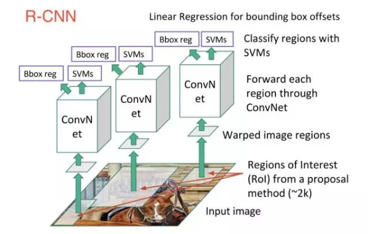
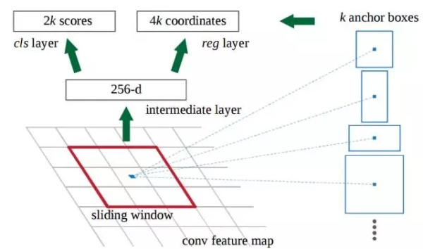

# Object Detection

- [Object Detection](#object-detection)
  - [2017.3](#2017-3)
  - [2017.4](#2017-4)
  - [2016.7](#2016-7)
  - [2016.9](#2016-9)
  - [Summary of FasterRnn RFCN SSD](#summary-of-fasterrnn-rfcn-ssd)
    - [FASTER RCNN](#faster-rcnn)

## Object Detection
物体检测

---------
### 2017 3
**目前物体检测模型大概的分类：**
1. region proposal，如RCNN、SPP-Net、Fast-RCNN、Faster-RCNN以及MSRA最近的工作R-FCN。
2. 不使用region proposal的，YOLO，SSD。

**Target And Trend (趋势及目标)**
* 让不同ROI之间尽量多的共享计算量，并充分利用CNN得到的特征，使得整个detection的速度变快。

**region proposal 流程**
1. 从待检测的图片中，提取出N个**ROI**，这里N远大于图片中真实object的个数。具体的方法有selective search、edge box以及最近流行起来的RPN。
2. 根据1中检测到的ROI，上CNN对图像进行feature extraction。
3. 对2中得到的feature进行分类，比如对于PSACAL VOC数据，就是一个21分类的问题（20个object class+background）。
4. boudningbox regression。

**tips:**
1. RCNN对于每个ROI，都跑一遍CNN，即使这些ROI之间是有overlap的，**显然有部分计算是重复的**，所以SPP-net和fast rcnn就在这方面做了文章，具体做法是先用CNN抽取整张图的特征，然后利用ROI pooling抽取对应ROI的特征，使得不同ROI共享特征提取的计算量。结果就是原来我处理一张图像需要前向2000次CNN，现在只要前向一次就好了，极大的提升了计算速度。
2. fast rcnn还通过multi-task loss实现了一个end to end 的系统，这里不是我们的重点。fast-rcnn提出来之后，detection的性能瓶颈变成了计算region proposal。CPU实现的selective search处理一张图需要2秒钟，远大于GPU上CNN特征抽取的时间。Faster RCNN就是要解决这个问题，他的出发点是这样的：既然用CNN进行feature extraction这一步已经无法避免，那么我们为什么不更充分地利用得到的feature？具体来说，我们是不是可以直接用CNN得到的feature来进行region proposal，答案是肯定的。
3. Faster RCNN将CNN得到的feature输入到一个两层网络（RPN），网络的输出就是region proposal。这样一来，**region proposal的额外开销就只有一个两层网络**。实验证明这样不仅速度变快，而且proposal的质量也更高了。
4. 到目前为止，上面我们说的4个步骤中，第1步和第2步都可以通过**前向一遍CNN**来得到，所以前俩步都不再是速度的瓶颈。
5. 然后我们考虑第3步，假设我们用faster rcnn的RPN得到了300个region proposal，在预测的过程中，我们需要对300个region proposal去做分类，每个region proposal都要经过多个FC层，这个时间开销仍然是很大的，所以就有了**R-FCN**这个工作。具体来说，是先利用FCN进行类似semantic segmentation的计算，然后利用ROI对相应的区域进行average pooling，得到整个ROI关于21个类别的置信度。简单的说就是把分类这个过程也融合到网络的前向计算过程中，由于这个过程对于不同的ROI是共享的，所以比单独跑分类器要快好多。文章里还有一个position-sensitive的idea，也很有趣，
6. 个人感觉object detection是一个比较考验insight以及”让一个idea真正能work的能力“的方向，不像semantic segmentation，后者现在的提升很多靠CRF，有陷入”图模型加圈“（传说中水论文三大法宝之一）的趋势，对数学要求比较高。

*作者：Old Xie  链接：https://www.zhihu.com/question/34223049/answer/110071873*

-------

### 2017 4
**目标检测框架大致的类别：**
#### 1. region proposal + refinement

检测分两步进行，以Faster R-CNN, R-FCN 等为代表；
Google 在16年下半年出了一篇paper，详细比较了Faster R-CNN、R-FCN和SSD的各个性能指标，还是很值得一读的。[Speed/accuracy trade-offs for modern convolutional object detectors](https://arxiv.org/abs/1611.10012)

上面的图即来自于Google的论文。一个比较粗略的结论是：
* 第一类框架（Faster R-CNN）的性能会更好，但是速度较慢；
* 而第二类框架（SSD）的性能略微逊色，但是速度较快。
当然这个结论并不是绝对成立的，具体得看不同的数据集类型、网络类型等等。

#### 2. 另一类是single stage的，一步到位回归出物体的位置，以SSD, YOLO 等为代表。

传统的目标检测总的发展方向有两条线：一条线是提高检测的精度、另一条线是提高检测的速度（效率）。
1. 对于提高检测的速度，从最初的R-CNN、Fast R-CNN、Faster R-CNN、SSD一路走来，私以为提高的空间已经不大了。SSD已经把能share的计算完全共享了，要再减小复杂度的话只能从精简网络结构/模型压缩等方面入手了（如PVANET:Lightweight Deep Neural Networks for Real-time Object Detection）。
2. 对于提高检测的精度，16年下半年来一个趋势是研究不同层之间的特征融合。一个很直观的想法是，神经网络的低层通常保留了比较多的细节特征（fine-grained）；而高层通常有更好的语义特征。所以怎么去结合不同层间的特征成了一个比较火的方向。

**papers:**
1.在不同层上面做proposal / pooling:
* [1607.07155] [A Unified Multi-scale Deep Convolutional Neural Network for Fast Object Detection](https://arxiv.org/abs/1607.07155)
* [SDP-CRC:CVPR 2016 Open Access Repository](https://www.cv-foundation.org/openaccess/content_cvpr_2016/html/Yang_Exploit_All_the_CVPR_2016_paper.html)
2.把不同层的特征级联在一起:
* [Towards Accurate Region Proposal Generation and Joint Object Detection](https://arxiv.org/abs/1604.00600)
3.bottom-up / top-down 的特征融合
* [1612.03144] [Feature Pyramid Networks for Object Detection](https://arxiv.org/abs/1612.03144)
* [Top-Down Modulation for Object Detection](https://arxiv.org/abs/1612.06851)
* [Deconvolutional Single Shot Detector](https://arxiv.org/abs/1701.06659)
4.多次迭代特征融合
* [1704.05776] [Accurate Single Stage Detector Using Recurrent Rolling Convolution](https://arxiv.org/abs/1704.05776)
等等类似的工作还有很多，在不同层上去取特征似乎已经成了目标检测一种套路了。

> 目标检测是一个很经典的问题。个人感觉现在要在这上面挖出一些gain来已经不是那么容易的了。或许可以关注一些相关的问题，比如视频中的目标检测、弱监督目标检测等等。
另外还有不少工作落脚于一些与目标检测紧密相关的任务上。比如Kaiming大神的[Mask R-CNN](https://arxiv.org/abs/1703.06870) 就是 object detection + segmentation + key point detection。这种多任务的学习可能也是一个值得关注的方向。

*链接：https://www.zhihu.com/question/34223049/answer/160336559*

------------------
### 2016 7
#### 传统方法的对比：

传统方法使用滑动窗口的框架，把一张图分解成几百万个不同位置，不同尺度的子窗口，针对每一个窗口使用分类器判断是否包含目标物体。

传统方法针对不同的类别的物体，一般会设计不同的特征和分类算法，比如
- 人脸检测的经典算法是**Harr特征+Adaboosting分类器**;
- 行人检测的经典算法是**HOG(histogram of gradients) + Support Vector Machine**;
- 一般性物体的检测的话是**HOG的特征 + DPM(deformable part model)**的算法。

基于深度学习的物体检测的经典算法是RCNN系列：**RCNN, fast RCNN(Ross Girshick), faster RCNN**。这三个工作的核心思想分别是：
* 使用更好的CNN模型判断候选区域的类别
* 复用预计算的sharing feature map加快模型训练和物体检测的速度
* 进一步使用sharing feature map大幅度提高计算候选区域的速度
其实基于深度学习的物体检测可以堪称对海量滑动窗口分类，只是使用的是全卷积的方式

RCNN系列算法还是将物体检测分为两个步骤。现在还有一些工作是端到端(end-to-end)的物体检测，比如说：
YOLO(You Only Look Once: Unified, Real-Time Object Detection)和SSD(SSD: Single Shot MultiBox Detector)这样的算法。
这两个算法号称和faster RNN精度相似但速度更快。物体检测正负样本极端非均衡，two-stage cascade可以更好的应对非均衡。端到端学习是否可以超越faster RCNN还需要更多研究试验。

------------

### 2016 9
1.ROI+DL主流，ROI主要是为了降低运算量，DL为了做检测分类，前面的答主都答得很详细了。
2.补充第二点，主要是无监督+目标检测，例如利用optical flow获取video的连续性,把连续性作为一个免费的supervision
* [Unsupervised Learning of Visual Representations using Videos](http://arxiv.org/abs/1505.00687),
* [UNSUPERVISED FEATURE LEARNING FROM TEMPORAL DATA](http://arxiv.org/pdf/1504.02518v2.pdf)，
结合之后就对检测能起到增强学习的一定作用。

### Summary of FasterRnn RFCN SSD

综述
> Faster R-CNN、R-FCN 和 SSD 是三种目前最优且应用最广泛的目标检测模型，其他流行的模型通常与这三者类似。
本文介绍了深度学习目标检测的三种常见模型：Faster R-CNN、R-FCN 和 SSD。

对图像中的每个目标进行识别、分类以外，还可以通过在该目标周围绘制适当大小的边界框（bounding box）来对其进行**定位**。这让目标检测技术较传统计算机视觉处理技术——图像分类而言，难度上升了不少。

目前最成功的目标检测方法是对图像分类模型的扩展。
Google 为 Tensorflow 发布了一个新的目标检测 API。与其同时发布的还有针对一些特定模型预构建的框架和权重。

* 基于 MobileNets 框架的 Single Shot Multibox Detector（SSD）模型。
* 基于 Inception V2 框架的 SSD 模型。
* 使用 ResNet-101 框架的基于 Region 的全卷积网络（R-FCN）模型。
* 基于 ResNet-101 框架的 Faster RCNN 模型。
* 基于 Inception ResNet v2 的 Faster RCNN 模型。

#### 本文内容
1. 深度学习是如何在目标检测中得到应用的。
2. 这些目标检测模型的设计是如何在相互之间获得灵感的同时也有各自的特点。

#### FASTER RCNN
> Faster R-CNN 模型现在是一个典型的基于深度学习的目标检测模型。在它的启发下，出现了很多目标检测与分割模型，比如本文中我们将会看到的另外两个模型。然而，要真正开始了解 Faster R-CNN 我们需要理解其之前的 R-CNN 和 Fast R-CNN。所以，现在我们快速介绍一下 Faster R-CNN 的来龙去脉。

##### R-CNN 模型

如果要拟人化比喻，那 R-CNN 肯定是 Faster R-CNN 的祖父了。换句话说，R-CNN 是一切的开端。

R-CNN，或称 Region-based Convolutional Neural Network，其工作包含了三个步骤：

* 借助一个可以生成约 2000 个 region proposal 的「选择性搜索」（Selective Search）算法，R-CNN 可以对输入图像进行扫描，来获取可能出现的目标。
* 在每个 region proposal 上都运行一个卷积神经网络（CNN）。
* 将每个 CNN 的输出都输入进：a）一个支持向量机（SVM），以对上述区域进行分类。b）一个线性回归器，以收缩目标周围的边界框，前提是这样的目标存在。

下图具体描绘了上述 3 个步骤：

换句话说，首先，我们给出一些建议区域，然后，从中提取出特征，之后，再根据这些特征来对这些区域进行分类。

本质而言，我们将**目标检测转化成了图像分类**问题。R-CNN 模型虽然非常直观，但是速度很慢。

##### Fast R-CNN

直接承接 R-CNN 的是 Fast R-CNN。

Fast R-CNN 在很多方面与 R-CNN 类似，但是，凭借两项主要的增强手段，其检测速度较 R-CNN 有所提高：

* 在推荐区域之前，先对图像执行特征提取工作，通过这种办法，后面只用对整个图像使用一个 CNN（之前的 R-CNN 网络需要在 2000 个重叠的区域上分别运行 2000 个 CNN）。
* 将支持向量机替换成了一个 softmax 层，这种变化并没有创建新的模型，而是将神经网络进行了扩展以用于预测工作。

Fast R-CNN 模型结构示意图：

如图所见，现在我们基于网络最后的特征图（而非原始图像）创建了 region proposals。因此，我们对整幅图只用训练一个 CNN 就可以了。

此外，我们使用了一个 softmax 层来直接输出类（class）的概率，而不是像之前一样训练**很多不同**的 SVM 去对每个目标类（object class）进行分类。**现在，我们只用训练一个神经网络，而之前我们需要训练一个神经网络以及很多 SVM。**

就速度而言，Fast R-CNN 提升了许多。

然而，存在一大未解决的瓶颈：用于生成 region proposal 的**选择搜索算法（selective search algorithm）**。

##### FASTER R-CNN

到现在为止，我们完成了对 Faster R-CNN 两大早期模型的溯源。下面我们开始研究 Faster R-CNN。

Faster R-CNN 的主要创新是，它用一个**快速神经网络**代替了之前**慢速的选择搜索算法（selective search algorithm）**。

**具体而言，它引入了一个 region proposal 网络（RPN）。**

RPN 工作原理：

* 在最后卷积得到的特征图上，使用一个 3x3 的窗口在特征图上滑动，然后将其映射到一个更低的维度上（如 256 维），
* 在每个滑动窗口的位置上，RPN 都可以基于 k 个固定比例的 anchor box（默认的边界框）生成多个可能的区域。
* 每个 region proposal 都由两部分组成：a）该区域的 objectness 分数。b）4 个表征该区域边界框的坐标。

换句话说，我们会观察我们最后特征图上的每个位置，然后关注围绕它的 k 个不同的 anchor box：一个高的框、一个宽的框、一个大的框等等。对于每个这些框，不管我们是否认为它包含一个目标，以及不管这个框里的坐标是什么，我们都会进行输出。

下图展示了在单个滑动框位置上发生的操作：

图中 2k 分数代表了 k 中每一个边界框正好覆盖「目标」的 softmax 概率。这里注意到，尽管 RPN 输出了边界框的坐标，然而它并不会去对任何可能的目标进行分类：它惟一的工作仍然是给出**对象区域**。如果一个 anchor box 在特定阈值之上存在一个「objectness」分数，那么这个边界框的坐标就会作为一个 region proposal 被向前传递。

一旦我们有了 region proposal，我们就直接把他们输入一个本质上是 Fast R-CNN 的模型。我们再添加一个池化层、一些全连接层以及最后，一个 softmax 分类层和边界框回归器（bounding box regressor）。所以在某种意义上，Faster R-CNN=RPN+Fast R-CNN。

