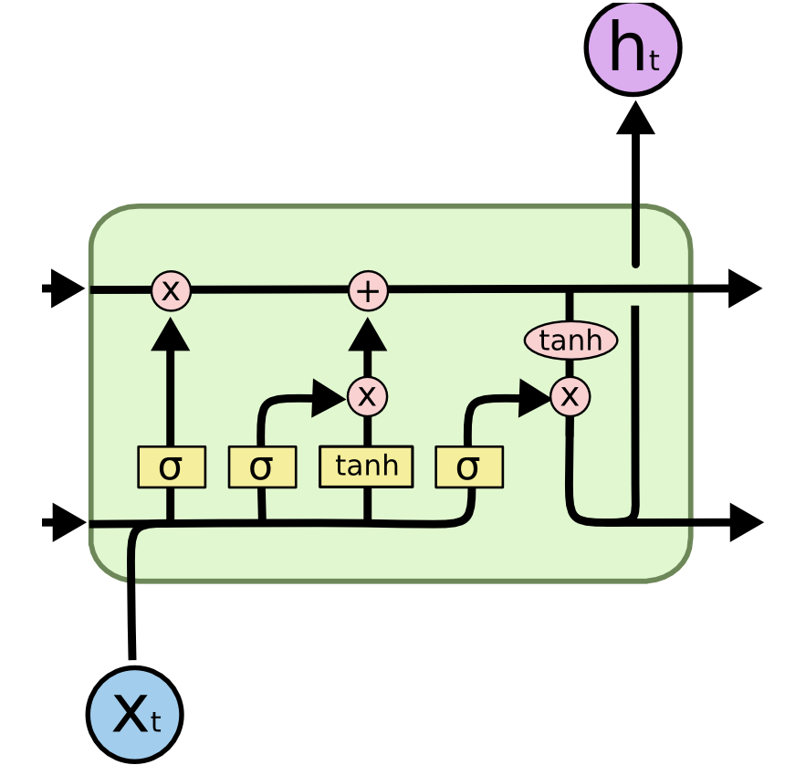
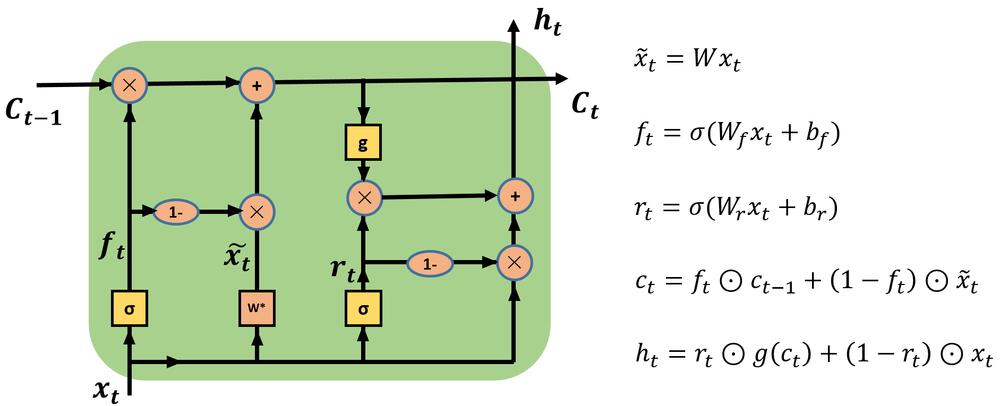

# RNN

## Table of Contents
- [Recurrent Neural Networks](#recurrent-neural-networks)
  - [LSTM](#long-short-term-memory)
  - [GRU](#gated-recurrent-unit)
  - [SRU](#simple-recurrent-unit)

## Recurrent Neural Networks

相当长的相关信息和位置间隔情况下，在理论上，RNN 绝对可以处理这样的 长期依赖 问题。人们可以仔细挑选参数来解决这类问题中的最初级形式，但在实践中，RNN 肯定不能够成功学习到这些知识。
然而，幸运的是，LSTM 并没有这个问题！

### Long Short Term Memory

Long Short Term 网络———— 一般就叫做 LSTM ——是一种 RNN 特殊的类型，可以学习长期依赖信息。
LSTM 通过刻意的设计来避免长期依赖问题。记住长期的信息在实践中是 LSTM 的默认行为。
所有 RNN 都具有一种重复神经网络模块的链式的形式。在标准的 RNN 中，这个重复的模块只有一个非常简单的结构，例如一个 tanh 层。
LSTM 同样是这样的结构，但是重复的模块拥有一个不同的结构。不同于 单一神经网络层，这里是有四个，以一种非常特殊的方式进行交互。

#### LSTM的核心思想
LSTM 的关键就是细胞状态，水平线在图上方贯穿运行。
细胞状态类似于传送带。直接在整个链上运行，只有一些少量的线性交互。信息在上面流传保持不变会很容易。

LSTM 有通过精心设计的称作为“门”的结构来去除或者增加信息到细胞状态的能力。门是一种让信息选择式通过的方法。他们包含一个 sigmoid 神经网络层和一个 pointwise 乘法操作。
LSTM 拥有三个门，来保护和控制细胞状态。（x,+,tanh）

#### 最左侧的门：忘记门
在我们 LSTM 中的第一步是决定我们会从细胞状态中丢弃什么信息。这个决定通过一个称为忘记门层完成。
该门会读取 h_{t-1} 和 x_t，输出一个在 0 到 1 之间的数值给每个在细胞状态 C_{t-1} 中的数字。1 表示“完全保留”，0 表示“完全舍弃”。

**因为这个门是"×"**，它决定丢弃信息。

让我们回到语言模型的例子中来基于已经看到的预测下一个词。在这个问题中，细胞状态可能包含当前主语的性别，因此正确的代词可以被选择出来。当我们看到新的主语，我们希望忘记旧的主语。

#### 中间的门：确定新的信息

这一步是：确定什么样的新信息被存放在细胞状态中。
包含两个部分：
1. sigmoid 层称 “输入门层” 决定什么值我们将要更新。
2. 一个 tanh 层创建一个新的候选值向量，会被加入状态中。
3. 我们会将这两个信息来产生对状态的更新。
在我们语言模型的例子中，我们希望增加新的主语的性别到细胞状态中，来替代旧的需要忘记的主语。

#### 上侧：更新细胞状态
左侧忘记门产生的值，和旧的细胞状态相乘，确定是否丢弃某些信息。
中间和C_t-1（旧的状态）相加，更新细胞状态（Cell）。

这就是新的候选值，根据我们决定更新每个状态的程度进行变化。
在语言模型的例子中，这就是我们实际根据前面确定的目标，丢弃旧代词的性别信息并添加新的信息的地方。

#### 右下侧：输出信息
最终，我们需要确定输出什么值。这个输出将会基于我们的细胞状态，但是也是一个过滤后的版本。

1. 首先，我们运行一个 sigmoid 层来确定细胞状态的哪个部分将输出出去。
2. 接着，我们把细胞状态通过 tanh 进行处理（得到一个在 -1 到 1 之间的值）并将它和 sigmoid 门的输出相乘，最终我们仅仅会输出我们确定输出的那部分。

在语言模型的例子中，因为他就看到了一个 代词，可能需要输出与一个 动词 相关的信息。例如，可能输出是否代词是单数还是负数，这样如果是动词的话，我们也知道动词需要进行的词形变化。

#### LSTM 还有其他的变体

1. 由 Gers & Schmidhuber (2000) 提出的，增加了 “peephole connection”。是说，我们让 门层 也会接受细胞状态的输入。我们增加了 peephole 到每个门上，但是许多论文会加入部分的 peephole 而非所有都加。

2. 另一个变体是通过使用 coupled忘记和输入门。不同于之前是分开确定什么忘记和需要添加什么新的信息，这里是一同做出决定。我们仅仅会当我们将要输入在当前位置时忘记。我们仅仅输入新的值到那些我们已经忘记旧的信息的那些状态 。

3. 另一个改动较大的变体是 Gated Recurrent Unit (GRU)，这是由 Cho, et al. (2014) 提出。它将忘记门和输入门合成了一个单一的 更新门。同样还混合了细胞状态和隐藏状态，和其他一些改动。最终的模型比标准的 LSTM 模型要简单，也是非常流行的变体。

#### LSTM方向
LSTM 是我们在 RNN 中获得的重要成功。很自然地，我们也会考虑：哪里会有更加重大的突破呢？在研究人员间普遍的观点是：“Yes! 下一步已经有了——那就是注意力！” 这个想法是让 RNN 的每一步都从更加大的信息集中挑选信息。例如，如果你使用 RNN 来产生一个图片的描述，可能会选择图片的一个部分，根据这部分信息来产生输出的词。实际上，Xu, et al.(2015)已经这么做了——如果你希望深入探索注意力可能这就是一个有趣的起点！还有一些使用注意力的相当振奋人心的研究成果，看起来有更多的东西亟待探索……
注意力也不是 RNN 研究领域中唯一的发展方向。例如，Kalchbrenner, et al. (2015) 提出的 Grid LSTM 看起来也是很有前途。使用生成模型的 RNN，诸如Gregor, et al. (2015) Chung, et al. (2015) 和 Bayer & Osendorfer (2015) 提出的模型同样很有趣。在过去几年中，RNN 的研究已经相当的燃，而研究成果当然也会更加丰富！

### Gated Recurrent Unit

### Simple Recurrent Unit

